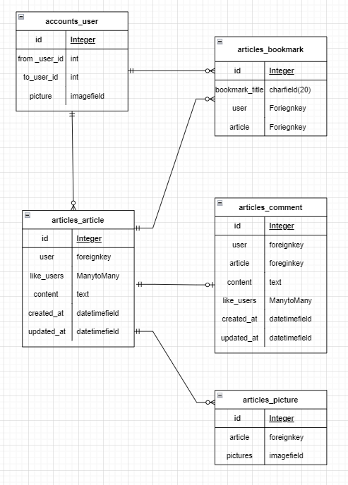

- 220419
- Instagram model 생성

.


- 220420

install

```
git ignore
django==3.2.12
pip freeze > requirements.txt
```

```
django-admin startproject dstagram .
django-admin startapp articles
django-admin startapp accounts
```


user_setting

```
```

- model 만들기
- articles_articles_index
- article_작성페이지 (create)
- article_delete